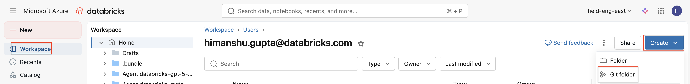
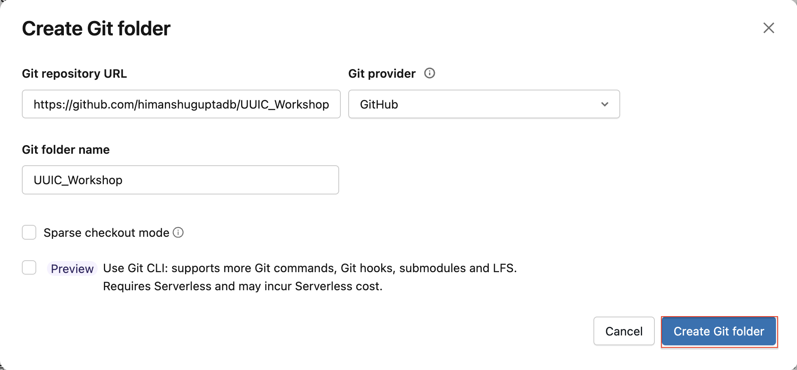
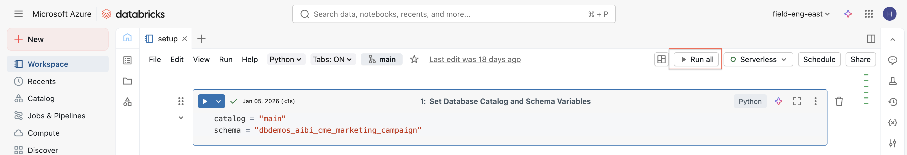

# UIUC Workshop – Genie, AI/BI dashboards, Unity Catalog

This repository contains hands-on workshop material focusing on **AI/BI Dashboards**, specifically **Genie** using **SQL/Python and Unity Catalog**.

The notebooks are designed to be run in a **Databricks workspace**.

---

## 🎯 Workshop Objectives

By completing this workshop, participants will learn how to:

- Configure schemas and catalogs in Unity Catalog
- Work with SQL/Python in Databricks notebooks
- Apply **row-level filtering**
- Use **Genie** to get insights from data using natural language
- Build Dashboards 

---

## Getting Started
 - Signup for [Databricks free edition](https://login.databricks.com/signup?provider=DB_FREE_TIER&dbx_source=www&itm_data=dbx-web&l=en-EN) if not alredy.
 Login to Databricks workspace.

 - Login to the Databricks workspace.

 - Click on "Workspace" -> Create -> Git as shown in the image below to import the git repo.
 

 - Import the git repo - https://github.com/himanshuguptadb/UIUC_Workshop as shown in the image below.
  

 - This will create a folder "UIUC_Workshop" in your workspace. Open the notebook "setup" and click on "Run All" as shown in the image below.
 

 - You have now completed the data setup for the workshop.
